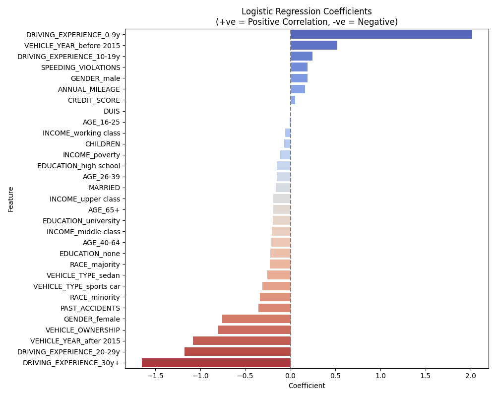

# Car Insurance Claim Prediction
**Problem Statement:** Predict whether or not a customer will file for a car insurance claim based on driving data and demographics. Identify how heavily each varibale affects the outcome.

# Project Overview
This project applies statistical modeling and machine learning in a real-world dataset containing 10,000 records and 19 columns. Using logistic regression, this model predicts the likelihood of a customer filing for a car insurance claim based on variables that range from age, number of children, DUIs, driving experience, and much more.  
The main purpose of this project is to understand how data and programming can assist decision making and lower risk within car and auto insurance.

# Educational Attainment
* Cleaned and prepared messy data (Removing null rows, applying categorical encoding).
* Evaluated model performance through accuracy, precision, recall, and f1-score.
* Created data visualizations comparing variables together to communicate insights effectively.
* Identified weak and strong indicators of car insurance claims.

# Dataset
Kaggle Link: [Car Insurance Data](https://www.kaggle.com/datasets/sagnik1511/car-insurance-data/data)  
Size: 10,000 rows x 19 columns  
Target Variable: OUTCOME
* (1) If the driver made a claim
* (0) If the driver did not make a claim

# Variables
* Demographics:
  * Age, Gender, Race, Education, Income, Marriage Status, Number of Children
* Vehicle Information:
  * Ownership, Year (Before or After 2015), Type (Sedan or Sports Car), Annual Mileage
* Driving History:
  * Driving Experience, Speeding Violations, DUIs, Past Accidents
* Credit History:

# Tools
* Python:
  * Pandas, Numpy, Scikit-Learn
* Machine Learning:
  * Logistic Regression
* Preprocessing:
  * StandardScaler, OneHotEncoder, SimpleInputer, Pipeline
* Data Visualization:
  * Seaborn, Matplotlib

# Model Performance
| Metrics | Percentage |
| :-- | :-- |
| Accuracy: | 85% |
| Precision: | 88% |
| Recall: | 91% |
| f1-score: | 89% |

# Key Insights
* Drivers who own their vehicles are less likely to file insurance claims.
* Fewer years of driving experience correlates with higher likelihood of car insurance claims.
* Drivers who own vehicles made after 2015 show lower claim rates.
  * Likely due to added vehicle features.
* Logistic regression models are commonly used in actuarial work.  

### Variable Coefficients Graph:  

# Future Improvements
* Adding and comparing additional models (e.g. Random Forest Models, Gradient Boosting Models, Tree-Based Models).
* Exploring interactions and correlations between variables (e.g. age and speeding violations).
* Implementing larger datasets that require more data cleaning.
* Applying additional actuarial concepts.

# Actuarial Science Relevance
This project applies real-world actuarial tools and tasks such as:
* Using python and machine learning to predict outcomes
* Performing logistic regression
* Identifying key insights used in data-driven decisions
* Communicating findings

# Author
**Kevin Chi**  
Incoming Freshman | University of Michigan - Ann Arbor  
Dual Major: Actuarial Mathematics and Data Science  
kevinchi164@gmail.com
